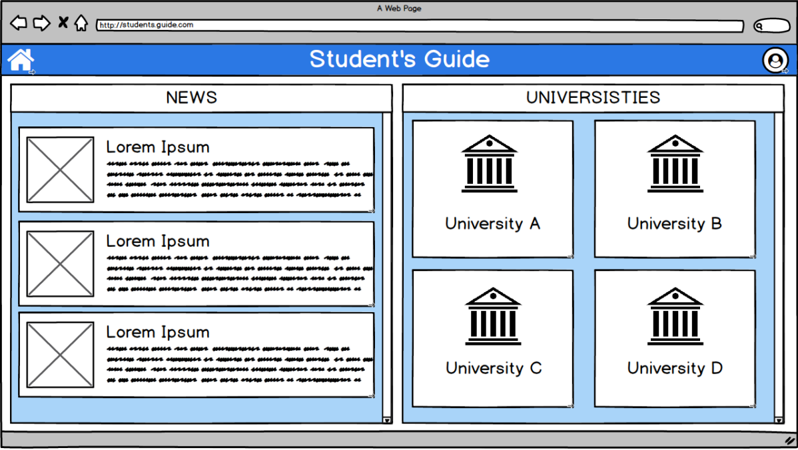

# Student's Guide

This a students project for HCI (Human Computer Interface) at Faculty of Mathematics and Informatics at Sofia University.

Student's Guide is unified social system thta brings all sudents in one place. It gives helps them to easaly ajust to the new suroundigs, to comunicate easily with their colleugues and to have all the information needed about their studing process. Student's Guide also gives them advices and show them a map with all things new students should know.

#Here is how our mockup looks like:

And the mockup itself [here](documentation/StudentsGuide.pdf)